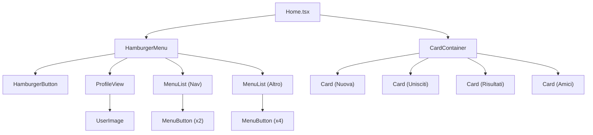
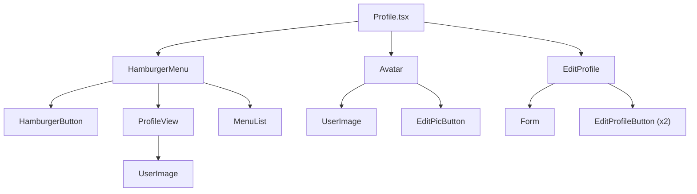
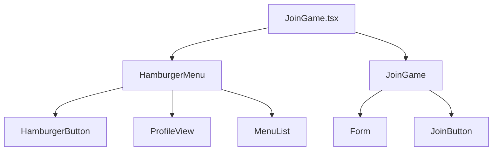
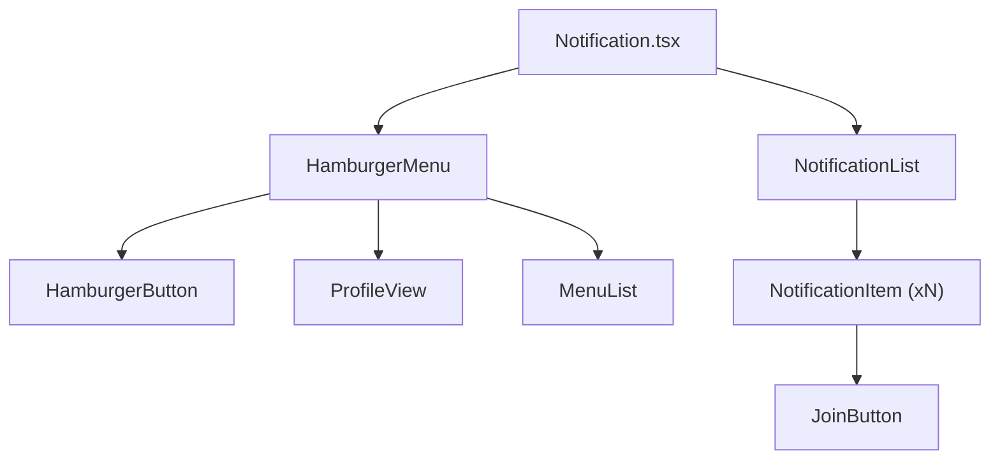
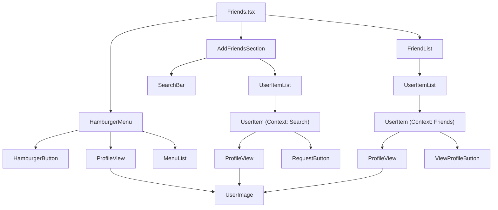
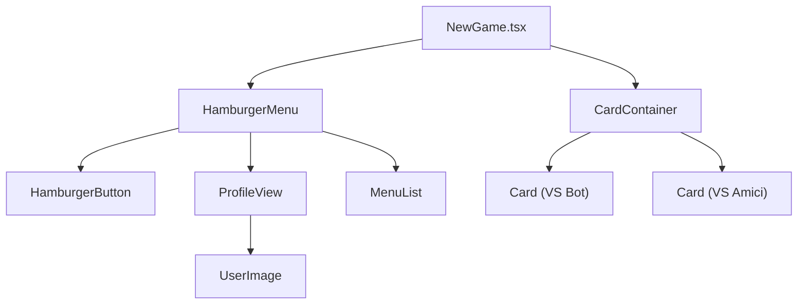
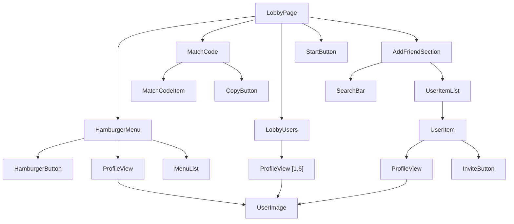
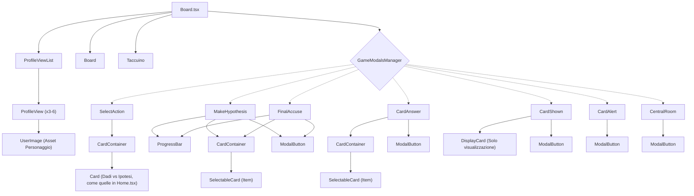

# Analisi Architettura Componenti (React)

In questo documento analizzo l'albero delle componenti pagina per pagina.

---

## 1. Home Page (`Home.tsx`)
Schermata di benvenuto con le card di navigazione.

---

## 2. Profile Page (`Profile.tsx`)
Gestione utente e modifica avatar. Notare il riutilizzo di `UserImage`.

---

## 3. JoinGame (`JoinGame.tsx`)
Pagina per entrare in una partita tramite codice.

---

## 4. Notification Page (`Notification.tsx`)
Pagina che mostra la lista degli inviti e avvisi.

---

## 5. Friends Page (`Friends.tsx`)
Gestione amici e ricerca.
*Nota: UserItemList e UserItem sono riutilizzati in due contesti diversi, cambiando solo il bottone d'azione.*

---

## 6. New Game Page (`NewGame.tsx`)
Pagina per scegliere la modalità di gioco.
*Nota: Esempio perfetto di riutilizzo. Usiamo lo stesso CardContainer della Home, passandogli solo 2 card invece di 4.*

---

## 7. Lobby Page (`LobbyPage`)
Pagina di attesa pre-partita.
*Nota: Riutilizzo di componenti. AddFriendSection qui serve per invitare alla partita, mentre in Friends.tsx serviva per aggiungere amici (inviare richies di amicizia).*

---

## 8. Board Page (`Board.tsx`)
La schermata di gioco vera e propria.
*Nota: ProfileView qui viene usato in modo ibrido: mostra l'immagine del PERSONAGGIO (pedina) ma il nome dell'UTENTE, mentre nelle altre pagine mostra l'immagine dell'utente e il nome dell'utente.*
Il componente visivo è sempre lo stesso (ProfileView: un tondo con un testo sotto), ma il dato che gli passiamo cambia:
In Home/Lobby: Immagine Utente + Nome Utente.
In Board: Immagine Personaggio (es. Miss Scarlett) + Nome Utente.

